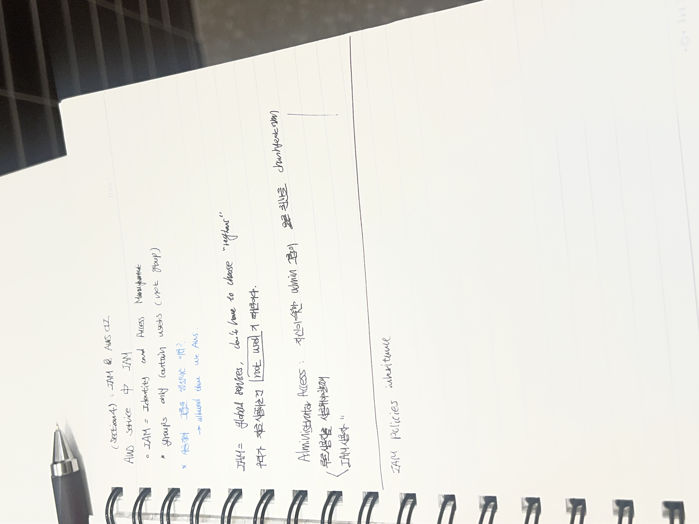
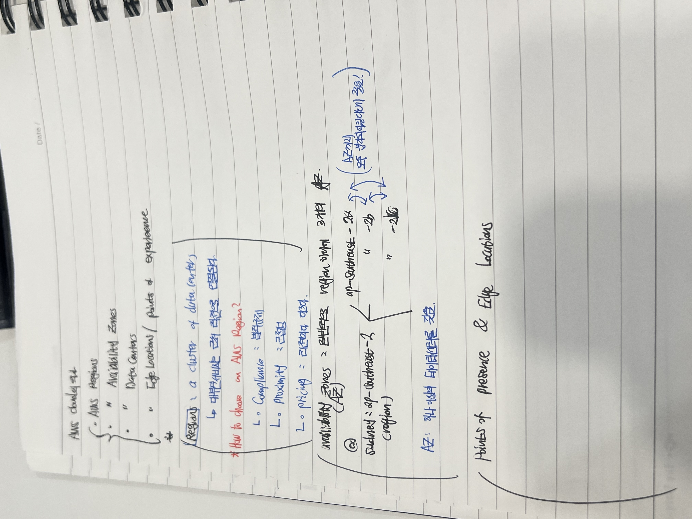

# 2026-06-30 공부기록 - 박찬혁

## 1. 담당 파트
Security / SRE 보조

## 2. 오늘 공부한 개념

### 💡 오늘 질문 & 답변 (Q&A) 요약

Q1. AWS 글로벌 인프라의 기본 구성 요소와 리전을 고르는 기준이 뭐야?

* **A1.** AWS 글로벌 인프라는 Regions, Availability Zones(AZ), Data Centers, Edge Locations 등으로 구성됩니다. 리전(Region)은 데이터 센터의 클러스터이며, 대부분의 서비스는 근처 리전으로 연결됩니다. 리전을 선택할 때는 **Compliance(법적 규제), Proximity(근접성/지연 시간), Pricing(리전별 가격 다름)** 세 가지를 고려해야 합니다.

Q2. 가용 영역(AZ)은 정확히 어떤 개념이고 왜 분리되어 있어?

* **A2.** 가용 영역(AZ)은 하나의 리전 하위에 보통 3개가 존재하며, 각각의 AZ는 하나 이상의 물리적 데이터 센터를 가지고 있습니다. 예를 들어 시드니 리전(ap-southeast-2)에는 ap-southeast-2a, 2b, 2c와 같은 가용 영역들이 있습니다. 이 가용 영역들은 모두 물리적으로 격리(분리)되어 있기 때문에 재해 복구나 고가용성 측면에서 매우 중요합니다.

Q3. IAM이 무엇이고 왜 사용하는 거야? 글로벌 서비스라는 게 무슨 의미지?

* **A3.** IAM(Identity and Access Management)은 유저의 인증과 권한 관리를 담당하는 AWS의 핵심 보안 서비스입니다. 리전을 따로 선택할 필요가 없는 **글로벌 서비스(Global Service)**에 해당합니다. 사용자를 그냥 두지 않고 그룹(Group)을 생성하여 관리하는 이유는 사용자들이 AWS를 안전하게 사용할 수 있도록 효율적으로 권한을 제어하기 위함이며, 그룹은 유저만 포함할 수 있고 다른 그룹을 포함할 수는 없습니다. 보안상 가장 주의해야 할 점은 **root user** 사용을 최소화하고 권한을 분리하는 것입니다.

Q4. Administrator Access 권한과 IAM 정책(Policy) 구조는 어떻게 돼?

* **A4.** 자신이 속한 admin 그룹이 모든 권한을 가질 수 있도록 설정하여 루트 사용자 대신 실무 관리자 역할을 수행할 수 있게 하는 권한입니다. 이러한 권한을 제어하는 IAM 정책(Policies)은 상속(Inheritance) 관계를 가질 수 있으며 JSON 구조로 이루어져 있습니다. 정책 구조는 크게 Version(정책 언어 버전, 항상 "2012-10-17"), Id(정책 식별자, 옵션), Statement(하나 이상의 개별 명령문, 필수)로 나뉩니다. Statement 내부는 Sid(명령문 식별자), Effect(Allow/Deny), Principal(적용 대상 계정/유저/역할), Action(허용/거부할 작업 목록), Resource(작업이 적용될 리소스 목록), Condition(조건, 옵션)으로 구성됩니다.

## 3. 내가 이해한 내용

* **글로벌 인프라와 보안의 연계:** IAM은 특정 리전에 종속되지 않는 글로벌 서비스이므로 전체 인프라 보안의 출발점이 된다. 리전을 선택할 때 가격이나 규제뿐만 아니라 보안 및 가용성을 위해 격리된 구조인 AZ(가용 영역)를 적극 활용해야 함을 이해했다.
* **최소 권한 원칙과 정책 관리:** 루트 유저의 직접 사용을 피하고, 유저들을 그룹화하여 상속(Inheritance) 구조를 통해 관리하는 것이 안전하다. IAM Policy의 Statement 규칙(Effect, Action, Resource 등)을 정확히 명시하여 화이트리스트 기반으로 권한을 통제하는 기틀을 파악했다.

## 4. GPT에게 물어본 질문

* AWS 리전을 선정할 때 기술적·비즈니스적으로 고려해야 하는 핵심 기준 3가지 (Compliance, Proximity, Pricing)
* 가용 영역(AZ)이 물리적으로 분리되어 설계된 이유와 하나의 AZ가 가질 수 있는 최소 데이터 센터 구조
* IAM이 글로벌 서비스로 동작하는 이유와 루트 사용자를 격리해야 하는 보안상의 이유
* IAM Group과 User 간의 관계 및 정책 상속(Policies Inheritance)이 적용되는 메커니즘
* IAM Policy JSON 구조에서 Version, Statement, Effect, Principal, Action, Resource가 의미하는 바와 작성 규칙

## 5. 새로 알게 된 점

* **리전 선택의 기준 다각화:** 단순히 가까운 곳(Proximity)만 고르는 게 아니라 법적 규제(Compliance)나 리전별로 다른 요금 체계(Pricing)까지 복합적으로 고려해야 함을 새로 알았다.
* **가용 영역(AZ) 격리의 중요성:** 하나의 AZ가 독립된 데이터 센터를 최소 하나 이상 보유하며, 이들이 서로 물리적으로 분리되어 있어야만 진정한 인프라 장애 극복(DR) 환경이 구축된다는 점을 배웠다.
* **IAM 그룹의 제약 조건:** IAM 그룹은 유저(User)만 담을 수 있으며, 디렉토리 구조처럼 그룹 내에 또 다른 그룹을 중첩하여 포함할 수 없다는 구조적 특징을 확인했다.
* **IAM 정책 문서 구조의 명확화:** IAM Policy를 구성하는 Statement 구조를 확실히 보았다. 허용/거부(Effect)뿐만 아니라, 어떤 행동(Action)을 어떤 리소스(Resource)에 적용할지 명확히 선언해야 하는 구조적 메커니즘을 깨달았다.

## 6. Must / Optional 후보

### Must 후보
* **[Security]** 보안 그룹 제어에 앞서, 루트 계정(root user) 대신 필요한 권한만 부여된 Administrator Access용 IAM 사용자를 별도로 생성하고 계정 탈취 및 비용·보안 사고를 원천 방지할 수 있는 IAM 보안 가이드라인 수립하기
* **[Security]** 화이트리스트 기반의 권한 제어를 위해 IAM Policy Structure 규칙(Effect, Action, Resource)에 맞추어 보안/SRE 업무에 꼭 필요한 권한만 정교하게 세팅된 커스텀 정책 설계하기

### Optional 후보
* **[Architecture]** 향후 서비스 확장 및 고가용성(HA) 확보를 위해, 단일 가용 영역 장애에 대응할 수 있도록 아키텍처 설계 시 ap-southeast-2a, 2b 등 다중 가용 영역(Multi-AZ) 분산 배치 구조 사전 검토하기

## 7. 아직 헷갈리는 부분

* IAM 정책(Policy)이 유저, 그룹, 역할(Role)에 복합적으로 상속 및 연결되었을 때, 명시적 거부(Deny)와 허용(Allow)이 충돌할 경우 실제 인프라 내부에서 최종 권한이 평가되는 우선순위 연산 과정

## 8. 내일 할 일
유데미 강의를 신청했다. 근데 뭔가 좀 방대한 느낌이라 프로젝트에 당장 써먹을 수 있는 지식만 있는 것 같지는 않다.

일단 지금 강의를 듣는 것도 좋은데, 프로젝트 전반에 대한 공부를 해야 하는 게 더 우선일것 같다.
AWS 자체를 공부하는거랑, 내가 프로젝트하면서 써야하는거랑은 다를 수도 있으니까,, 조금 우선순위를 둘 필요가 있을거같음.

가장 좋은 건 둘 다 동시에 해나가는건데, 강의가 양이 꽤 많아서 프로젝트 기간까지 듣는 것도 괜찮을 거 같기도 하고,,
일단 아직 프로젝트에 대한 지식이 많이 부족하니, 그것부터 채우고 강의 내용은 필요할 때마다 채우는 식으로 하는게 좋을 거 같다.

## 9. 참고한 자료

